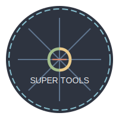

# 🕷️ Super Tools Spider

<p align="center">
  
</p>

一个基于NestJS框架开发的社交媒体内容爬虫工具。

## 🛠️ 技术栈

- NestJS - 后端框架
- TypeScript - 开发语言
- Node.js - 运行环境
- Puppeteer - 爬虫引擎

## 📦 安装和使用

1. 克隆项目
```bash
git clone [项目地址]
```

2. 安装依赖
```bash
npm install
```

3. 运行开发环境
```bash
npm run start:dev
```

4. 构建生产环境
```bash
npm run build
```

## 📁 项目结构

```
src/
├── crawler/          # 小红书爬虫模块
├── crawlerHome/      # 爬虫主页模块
└── main.ts          # 应用程序入口文件
```

## 📈 开发进度

### 🎯 第一阶段 - 小红书爬虫（已完成）
- [x] 基础框架搭建
- [x] 爬虫核心功能实现
- [x] 数据存储模块
- [x] API接口开发
- [x] 单个笔记爬取
- [x] 用户首页图片爬取 

### 🔄 第二阶段 - 抖音爬虫（计划中）
- [ ] 抖音API研究和分析
- [ ] 开发抖音爬虫模块
- [ ] 实现视频内容下载
- [ ] 数据分析功能

### 🔨 第三阶段 - 功能优化（计划中）
- [ ] 提升爬虫性能
- [ ] 添加数据分析dashboard
- [ ] 优化用户界面
- [ ] 添加数据导出功能

## ⚠️ 注意事项

1. 请确保遵守目标平台的使用条款和规范
2. 建议使用代理IP池避免被封禁
3. 注意控制爬取频率，避免对目标服务器造成压力

## 🤝 贡献指南

欢迎提交 Pull Request 或提出 Issue。

## 📄 许可证

[MIT License](LICENSE) 